# 🧪 Pengujian Mini Habit Tracker

Berikut adalah dokumentasi pengujian dari fitur-fitur utama pada aplikasi Mini Habit Tracker, dilengkapi dengan tangkapan layar pada setiap langkah.

---

### ✅ 1. Jalankan Aplikasi
Aplikasi berhasil dijalankan menggunakan `flutter run`.

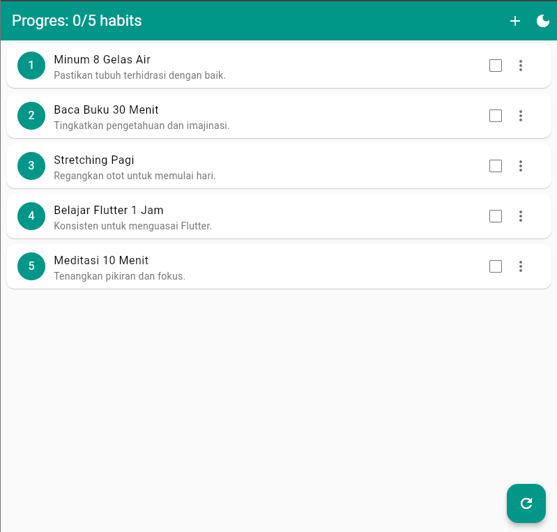

---

### ✍️ 2. Uji Strikethrough
Centang dan batalkan centang pada habit. Teks akan dicoret ketika habit ditandai selesai.

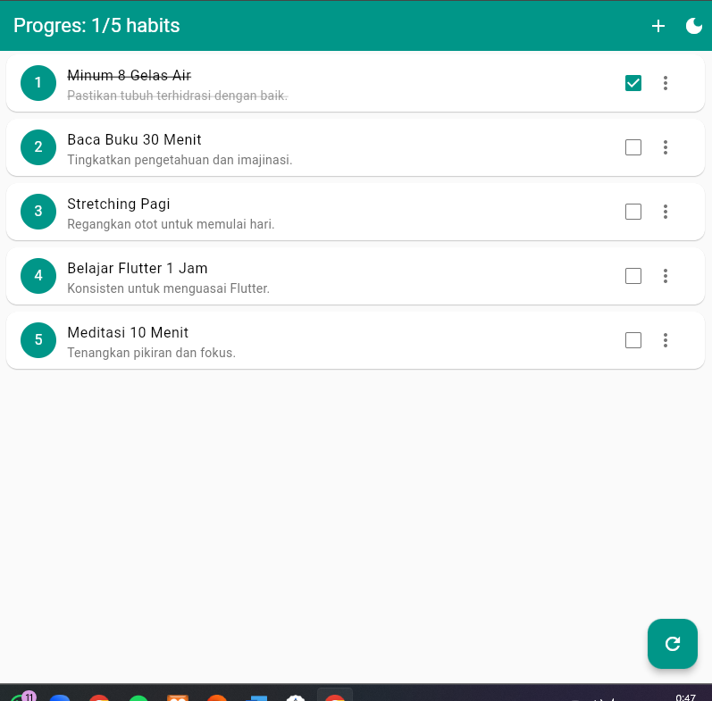

---

### ➕ 3. Uji Tambah Habit

**a. Klik tombol + di AppBar.**

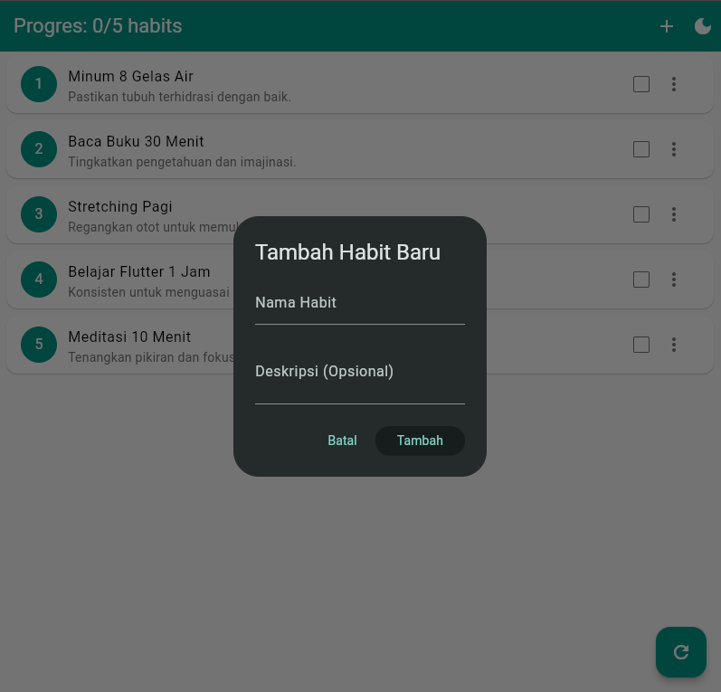

**b. Coba simpan tanpa mengisi nama (validasi muncul).**

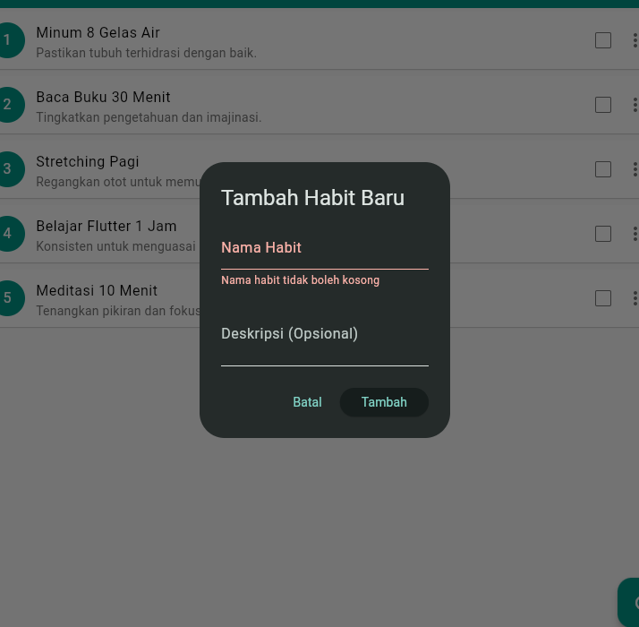

**c. Isi form dan simpan. Habit muncul di daftar.**

---

### ✏️ 4. Uji Edit Habit

**a. Klik menu tiga titik pada habit, pilih "Edit".**
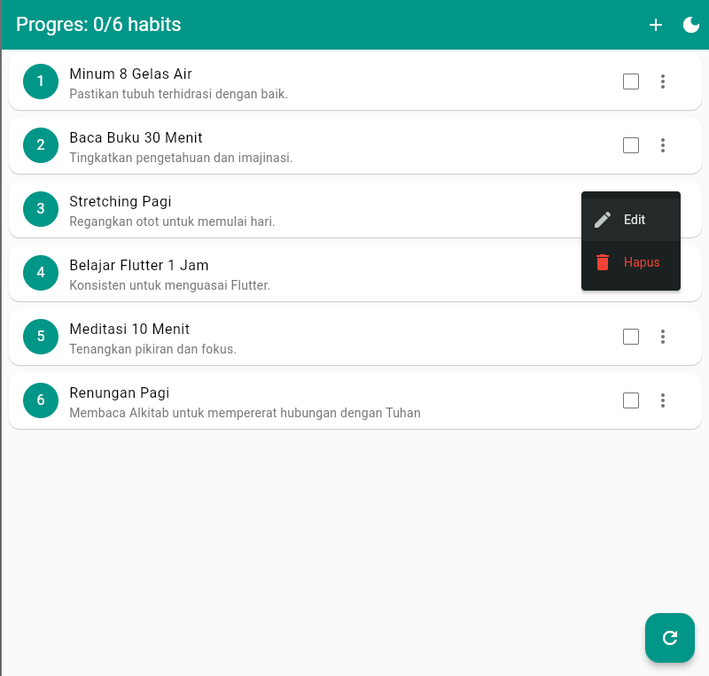

**b. Form edit muncul dengan data yang sudah ada.**
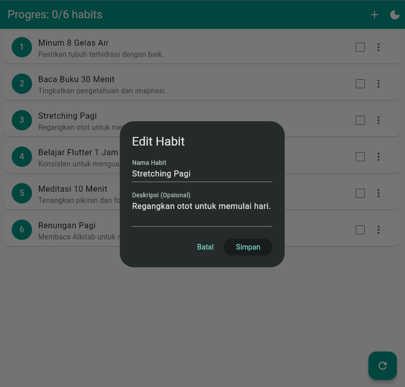

**c. Edit data lalu simpan. Perubahan tampil di list.**
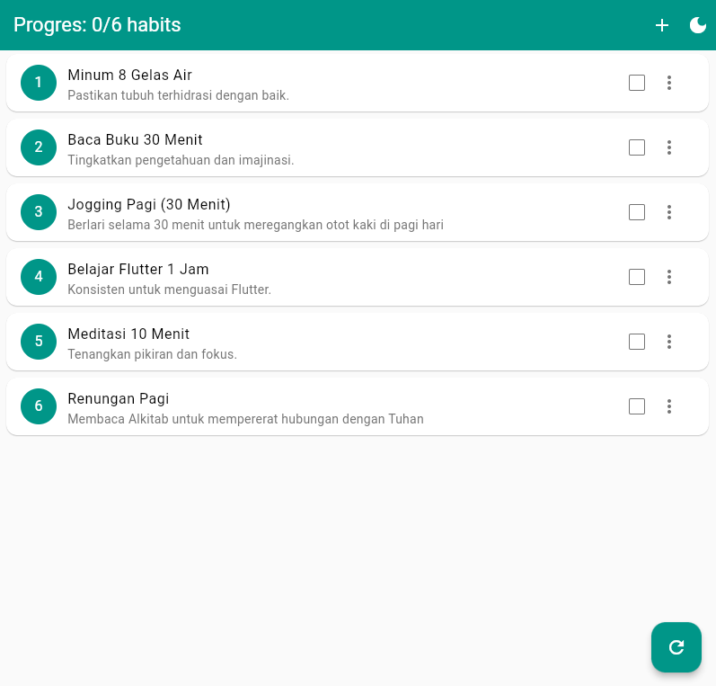

---

### 🗑️ 5. Uji Hapus Habit

**a. Klik menu tiga titik, pilih "Hapus".**
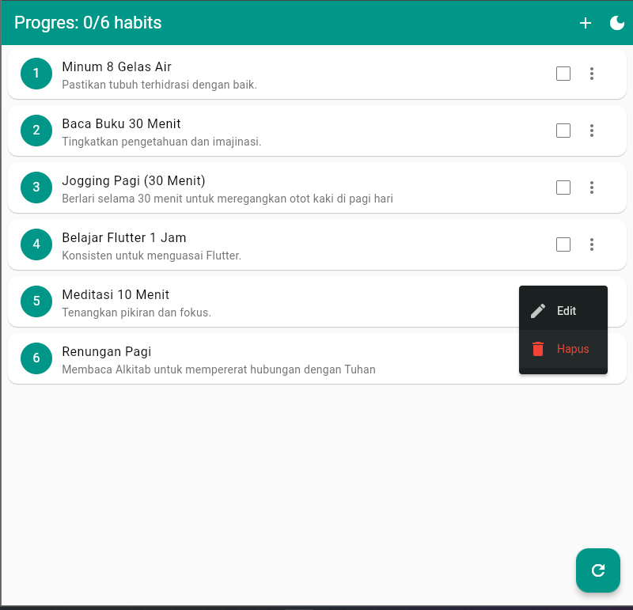

**b. Dialog konfirmasi muncul. Klik batal.**
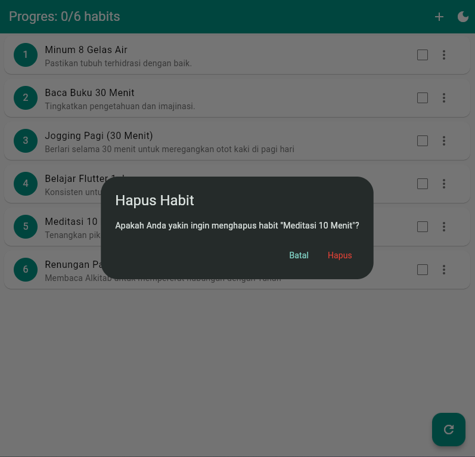

**c. Coba hapus lagi dan klik "Hapus". Habit hilang.**
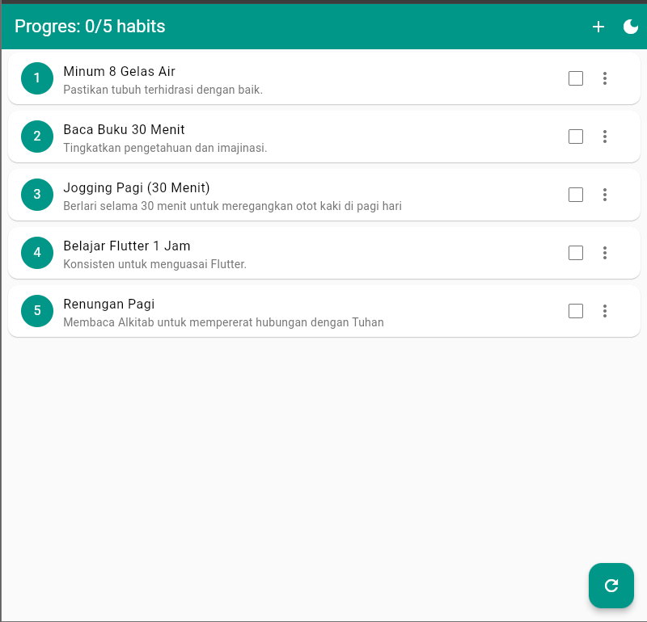

---

### 📊 6. Uji Progress Bar

Progress bar di AppBar berubah setelah centang, tambah, atau hapus habit.

**a. Tambah**

**b. Centang**

**c. Hapus**

---

### 🔄 7. Uji Reset

Tombol "Reset" mengembalikan semua `isDone` menjadi false.

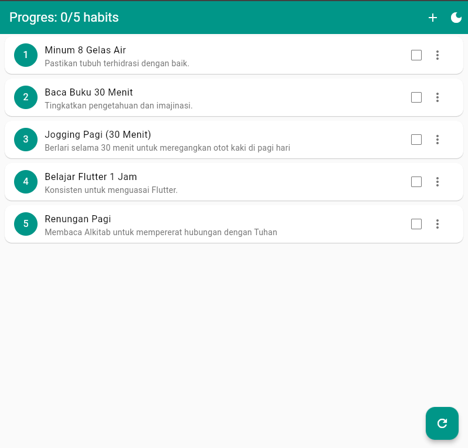

---

### 🔁 8. Uji Ephemeral State

Tutup aplikasi dan buka kembali. Semua data kembali ke default dari `habits.json`.

---
